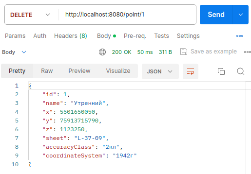

## Приложение D. Postman.

Postman - это приложение, позволяющее тестировать web-API.

Запустим наше приложение и Postman.
Для получения всех записей из базы данных выполним запрос:
```html
GET http://localhost: 8080/point
```

Результат запроса:


Для получения записи по существующему идентификатору выполним запрос:

```html
GET http://localhost: 8080/point/3

```

Результат запроса:


Для получения записи по несуществующему идентификатору выполним запрос:

```html
GET http://localhost: 8080/point/10

```

Результат запроса:


Для получения списка пунктов с названием, содержащим указанный фрагмент выполним запрос:

```html
GET http://localhost: 8080/point/name/290

```

Результат запроса:


Для получения ответа сервера на запрос списка пунктов с названием, содержащим указанный фрагмент, в случае отсутствия таковых, выполним запрос:

```html
GET http://localhost: 8080/point/name/Пункт

```

Результат запроса:


Для получения списка пунктов с номенклатурой листа, содержащий указанный фрагмент выполним запрос:

```html
GET http://localhost: 8080/point/sheet/L-37-09

```

Результат запроса:


Для получения ответа сервера на запрос списка пунктов с номенклатурой листа, содержащей указанный фрагмент, в случае отсутствия таковых, выполним запрос:

```html
GET http://localhost: 8080/point/sheet/M-37

```

Результат запроса:


Для удаления записи по существующему идентификатору выполним запрос:

```html
DELETE http://localhost: 8080/point/1

```
Результат запроса:



Для получения всех оставшихся записей из базы данных выполним запрос:

```html
GET http://localhost: 8080/point
```

Результат запроса:


Попытаемся удалить запись по несуществующему идентификатору и выполним запрос:

```html
DELETE http://localhost: 8080/point/10

```
Результат запроса:


Добавим новую запись в базу данных. Для этого подготовим тело запроса и выполним запрос:

```html
POST http://localhost: 8080/point/

```
Результат запроса:


Для получения всех записей из базы данных выполним запрос:

```html
GET http://localhost: 8080/point
```

Результат запроса:


Обновим информацию о добавленном пункте. Для этого подготовим тело запроса и выполним запрос:

```html
PUT http://localhost: 8080/point/8

```
Результат запроса:


Для получения всех записей из базы данных выполним запрос:

```html
GET http://localhost: 8080/point
```

Результат запроса:


Попробуем обновить информацию о пункте, с несуществующим идентификатором. Для этого подготовим тело запроса и выполним запрос:

```html
PUT http://localhost: 8080/point/10

```
Результат запроса:


Для демонстрации поиска пунктов в указанной области, изменим метод **onCreatedDatabase** класса [BasePointServiceImlp](https://github.com/AndrewNizovkin/diploma/blob/main/geocatalog/src/main/java/ru/geekbrains/geocatalog/service/BasePointServiceImpl.java) который создаст 10 произвольных пунктов с координатами не выходящими за пределы области с координатами Xmin = 0, Ymin = 0, Xmax = 1000, Ymax = 1000:

```java
    @EventListener(ContextRefreshedEvent.class)
    public void onCreatedDatabase() {
        Random random = new Random();
        for (int i = 0; i < 10; i++) {
        basePointRepository.save(new BasePoint(
                "basePoint_" + (i + 1),
                random.nextInt(1000),
                random.nextInt(1000),
                random.nextInt(100),
                "Empty",
                "Empty",
                "Empty"
                ));

        }
    }
```

Перезапустим приложение. Подготовим тело запроса и выполним запрос:

```html
POST http://localhost: 8080/point/area

```
Результат запроса:


Попробуем получить список пунктов в пустой области. Подготовим тело запроса и выполним запрос:

```html
POST http://localhost: 8080/point/area

```
Результат запроса:

