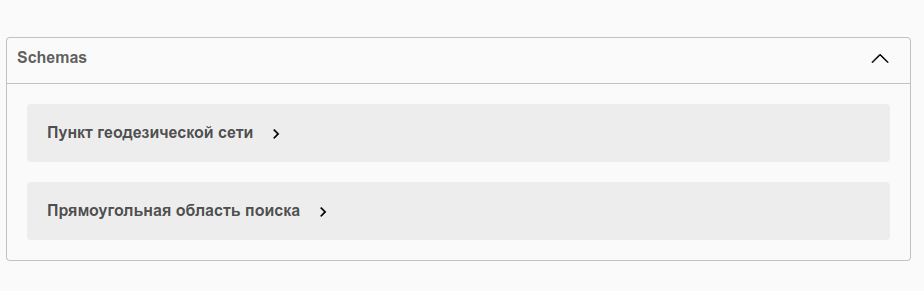

## Приложение C. Swagger.
Swagger – это инструмент, который помогает разработчикам создавать, документировать и проверять API. API – это набор правил и протоколов, которые позволяют различным системам обмениваться информацией между собой.

Запустим приложение и выполним в браузере запрос:

```html
localhost:8080/swagger-ui/index.html
```

Результат запроса:




Графический интерфейс Swagger предоставляет возможность не только в интерактивном режиме изучать спецификацию Rest Full Api, но и отправлять запросы.


Изучаем схему:


Выполним POST-запрос на добавление нового пункта:


Выполним GET-запрос на получение пункта с несуществующим ID:


Для получение JSON-спецификации выполним в браузере запрос:

```html
http://localhost:8080/v3/api-docs
```

Результат запроса:


Полную спецификацию можно просмотреть, перейдя по [ссылке](https://github.com/AndrewNizovkin/diploma/blob/main/open_api.md)
